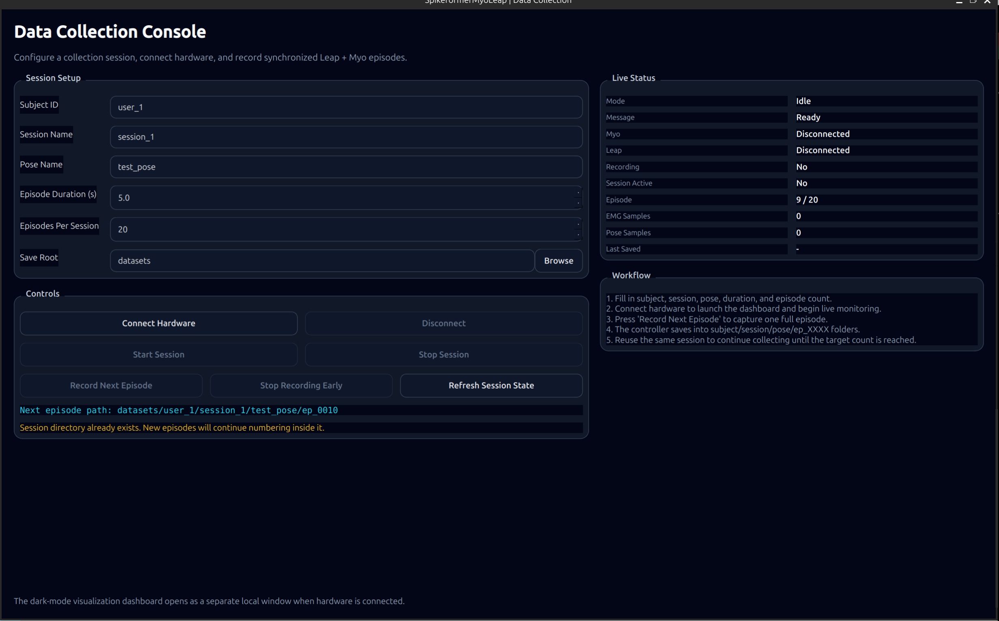

# SpikeformerMyoLeap

Version 2 of the SpikeformerMyo project. This repository contains a standalone, robust pipeline for collecting synchronized 21-joint 3D hand poses via Leap Motion (`leapc-python-bindings`) and 8-channel EMG data from the Myo armband (`pyomyo`).

## Features
- **Standalone Environment**: Uses `uv` and `pyproject.toml` to manage dependencies, including local CFFI compilation for the Leap SDK.
- **Hydra Configuration**: Collection defaults live in `conf/config.yaml`.
- **Importable Package Layout**: Core collection, visualization, and data-IO logic now live under `src/spikeformer_myo_leap/` instead of only in top-level scripts.
- **Package Entry Points**: Runnable script entry points now live under `src/spikeformer_myo_leap/scripts/`, while top-level scripts remain compatibility wrappers.
- **Professional Local Visualizers**: Dark-mode desktop dashboards for Leap-only, Myo-only, and full collection monitoring.
- **Desktop Collection UI**: A `PySide6` collection console for subject/session/pose setup, session control, and guided episode recording.
- **Embedded Live Preview**: The collection GUI now includes native in-window Leap hand and Myo EMG previews instead of spawning a second dashboard window.
- **Collector Recovery**: Inter-episode save/finalization, stream-health monitoring, and reconnect handling have been hardened for Myo/Leap faults.
- **Dataset Reviewer**: A separate desktop reviewer can replay saved episodes, inspect health metadata, and delete bad takes.
- **Optional Rerun Path**: Rerun remains available as an optional backend, but the default workflow now avoids its Linux GPU issues.

See [Project Summary](docs/PROJECT_SUMMARY.md) for the longer architecture and roadmap notes.

## Collection Showcase

GUI-based collection workflow:



Combined Leap + Myo collection preview:


Recorded previews:
- [Leap visualizer demo](docs/media/leap-visualizer.webm)
- [Combined Leap + Myo collection video](docs/media/combined-data-collection.webm)

## Quickstart

1. Clone this repository adjacent to the `leapc-python-bindings` repository.
2. Setup the environment:
```bash
./setup_env.sh
source .venv/bin/activate
```
3. (Optional) Run standalone visualizers to test hardware:
```bash
uv run visualize_leap.py
uv run visualize_myo.py
```
Both commands default to the local dark-mode viewer. If you still want the Rerun path, use:
```bash
uv run visualize_leap.py --viewer rerun
uv run visualize_myo.py --viewer rerun
```
4. Start the GUI-based collection app:
```bash
uv run collection_gui.py
```
This is now the primary collection workflow. It provides:
- subject / session / pose configuration
- episode duration and episodes-per-session controls
- connect / disconnect hardware buttons
- start / stop session
- record next episode
- stop recording early
- session-aware save paths
- embedded live Leap hand and Myo EMG previews
- worker-backed hardware control so the GUI stays isolated from the sensor process

5. Legacy terminal collector (fallback only):
```bash
uv run leap_myo_data_collection.py
```
Press `Space` to record the next episode, `s` to stop early and save, and `Esc` or `q` to quit.

6. Review saved data:
```bash
uv run replay_dataset.py
```
This opens a dedicated dataset reviewer GUI for:
- browsing saved episodes under a dataset root
- replaying Leap pose and rolling EMG
- checking simple per-episode health indicators
- deleting bad episodes with confirmation

7. Preprocessing smoke test:
```bash
uv run preprocess_dataset.py
```
This currently validates that the preprocessing stack can discover the dataset and build an episode manifest from the saved collection layout.

8. Training and evaluation entry points:
```bash
uv run train.py
uv run evaluate.py
```
These packaged entry points now use Hydra YAML configs on top of the importable model, training, and preprocessing modules.

By default, `uv run train.py` uses the full dataset under `datasets/` via the default Hydra dataset preset.

Example single-dataset training smoke test:
```bash
uv run train.py \
  model=transformer \
  dataset=user1_session2_test_pose \
  num_epochs=1 \
  batch_size=16 \
  device=cpu \
  output_dir=artifacts/train_smoke \
  model.model_kwargs.embed_dim=32 \
  model.model_kwargs.num_layers=2
```

Example full-dataset runs for each model:

```bash
uv run train.py model=spikeformer
```

```bash
uv run train.py model=transformer
```

```bash
uv run train.py model=cnn_lstm
```

```bash
uv run train.py model=cnn
```

```bash
uv run train.py model=spiking_cnn
```

You can combine those with dataset or optimization overrides, for example:

```bash
uv run train.py model=transformer dataset=user1_session2_test_pose num_epochs=1 device=cpu
```

Useful dataset presets:
- `dataset=default`: `xyz` point targets with palm-frame normalization
- `dataset=default_joint_angles`: `xyz` joint-angle targets
- `dataset=default_xy_compat`: `xy` compatibility mode for older-style comparisons

If `visualize: true` and `visualizer_backend: "local"` are enabled, the legacy collector uses the same local dashboard for:
- tracked 3D Leap hand pose
- rolling 8-channel EMG traces
- live session metadata such as subject, pose, episode progress, and sample counts

## Data Layout

Both the GUI collector and the legacy terminal collector save through the same backend and use the same folder structure:

```text
datasets/<subject_id>/<session_name>/<pose_name>/ep_0001/
```

Each episode contains:
- `emg.csv`
- `pose.csv`
- `meta.json`

`meta.json` includes the effective per-episode sampling rates:
- `effective_emg_hz`
- `effective_pose_hz`

These are derived from the actual captured sample counts and recorded duration, and should be used later during data cleaning and resampling rather than assuming a fixed acquisition rate.

## Collection Status

The collection stack now includes the following robustness improvements:
- stream-health monitoring for Myo and Leap
- abort/discard behavior for affected recordings instead of silently saving bad takes
- explicit episode finalization handling so the next episode cannot start before save completes
- continuous stream buffering for episode slicing instead of direct callback-owned episode buffers
- Myo reconnect cleanup after device/port faults
- a worker-backed GUI path so hardware/control failures do not directly freeze the Qt window

The terminal collector remains useful as a fallback path:
- `uv run leap_myo_data_collection.py`

The GUI path is now intended to be the main operator workflow:
- `uv run collection_gui.py`

Known caveat:
- the Myo device/serial layer can still fault after several episodes on some setups; the code now handles that more gracefully, but the underlying transport is not guaranteed stable in all cases.

## Code Layout

The current working code is now organized as an importable package:

```text
src/spikeformer_myo_leap/
  app/            # desktop GUI entry logic
  collection/     # hardware lifecycle and recording controller
  config/         # shared config dataclasses and defaults
  data/           # raw IO, manifests, loaders, transforms, preprocessing
  models/         # one file per model family plus a registry
  scripts/        # package-level runnable entry points
  training/       # dataset adapters, configs, train/eval loops
  visualization/  # local dashboard and optional Rerun viewers
```

Current responsibilities:
- `app/`: desktop GUI entry logic
- `collection/`: hardware lifecycle, recording controller, terminal collector wrapper, and GUI worker client
- `config/`: preprocessing and future training configuration objects
- `data/`: shared contracts, save/load helpers, raw episode discovery, manifests, loaders, and preprocessing
- `models/`: Spikeformer, Transformer, CNN-LSTM, CNN, and spiking CNN regressors
- `scripts/`: package-level runnable entry points
- `training/`: dataset builders, training config objects, and train/evaluate loops
- `visualization/`: local dashboard and optional Rerun viewers

The top-level scripts are kept as thin wrappers so existing commands still work.

Each major package folder now carries a small local `README.md` as it is introduced, so the structure stays self-documented while preprocessing and training modules are added.

## Preprocessing Readiness

The preprocessing branch is now adding the first dedicated data-pipeline modules:
- a shared data contract for collection settings and landmark naming
- centralized episode save/load helpers
- raw dataset discovery utilities via `spikeformer_myo_leap.data.raw`
- episode manifest building via `spikeformer_myo_leap.data.manifest`
- array loaders via `spikeformer_myo_leap.data.loaders`
- resampling and pose transforms via `spikeformer_myo_leap.data.preprocessing` and `spikeformer_myo_leap.data.transforms`

Current preprocessing options now include:
- EMG standardization using train-split channel statistics
- wrist-relative pose translation
- palm-frame rotation normalization using:
  - wrist
  - index MCP
  - pinky MCP
- configurable target representations:
  - `points` for direct joint-coordinate regression
  - `joint_angles` for per-finger articulation-angle regression

Recommended defaults for the current Leap+Myo setup:
- `target_mode=xyz`
- `target_representation=points` for the first baseline
- `use_palm_frame_pose=true`
- `normalize_emg=true`
- `standardize_targets=true`

That means the next preprocessing/training work can be built on stable importable interfaces instead of adding more logic into top-level scripts.

## Training Status

The repo now also includes the first packaged training/evaluation foundation:
- separate model files for:
  - Spikeformer
  - Transformer
  - CNN-LSTM
  - CNN
  - spiking CNN
- Hydra-backed `train.py` and `evaluate.py`
- episode-level train/val split
- window-level validation each epoch
- full-episode validation with saved qualitative outputs

This is sufficient for baseline training runs, but model comparison, normalization refinements, and streaming inference remain follow-up work.

The training/evaluation stack now also:
- fits EMG and target normalization on the train split
- reuses those stats for validation and checkpoint evaluation
- stores normalization stats inside checkpoints for future evaluation/inference reuse
